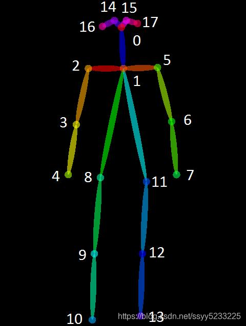
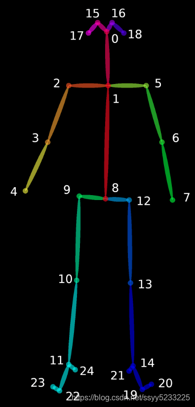

### OpenPose 的 18 和 25 关节点对应顺序

1、18 点模型  



对应位置：  

```
// {0, "Nose"},  
// {1, "Neck"},  
// {2, "RShoulder"},  
// {3, "RElbow"},  
// {4, "RWrist"},  
// {5, "LShoulder"},  
// {6, "LElbow"},  
// {7, "LWrist"},  
// {8, "RHip"},  
// {9, "RKnee"},  
// {10, "RAnkle"},  
// {11, "LHip"},  
// {12, "LKnee"},  
// {13, "LAnkle"},  
// {14, "REye"},  
// {15, "LEye"},  
// {16, "REar"},  
// {17, "LEar"}  
```


2、25 点模型  
  
对应位置：  

```
{0, "Nose"},  
{1, "Neck"},  
{2, "RShoulder"},  
{3, "RElbow"},  
{4, "RWrist"},  
{5, "LShoulder"},  
{6, "LElbow"},  
{7, "LWrist"},  
{8, "MidHip"},  
{9, "RHip"},  
{10, "RKnee"},  
{11, "RAnkle"},  
{12, "LHip"},  
{13, "LKnee"},  
{14, "LAnkle"},  
{15, "REye"},  
{16, "LEye"},  
{17, "REar"},  
{18, "LEar"},  
{19, "LBigToe"},  
{20, "LSmallToe"},  
{21, "LHeel"},  
{22, "RBigToe"},  
{23, "RSmallToe"},  
{24, "RHeel"},
```

