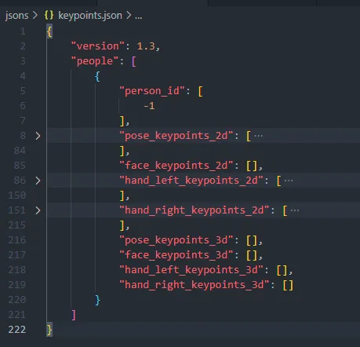
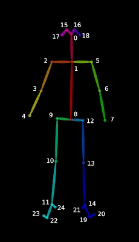
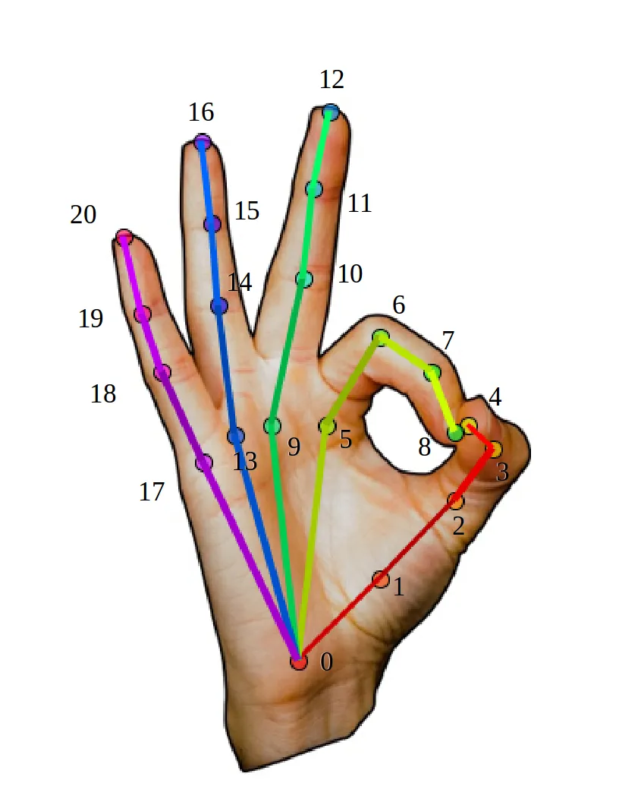
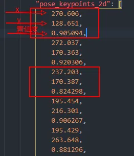
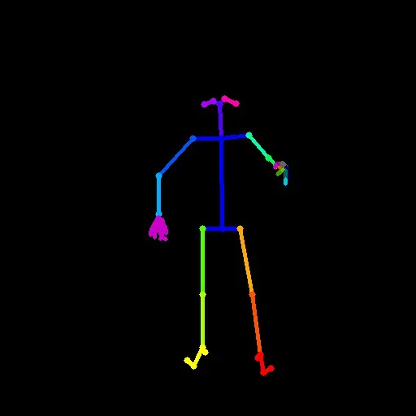

> 本文详细介绍了如何利用 openpose 产生的 json 骨骼数据信息，来在原始图像中重新生成骨架示意图，并给出了完整的 python 代码示例。 openpose 重绘 json 里的骨骼信息

环境
--

*   windows 10 64 bit
*   opencv 4.5.3

需求
--

这是来自一位网友的需求，他已经拿到了团队内其它成员通过 `openpose` 处理后的 `json` 数据 (这部分内容前文 [windows 编译 openpose 及在 python 中调用](https://xugaoxiang.com/2021/05/29/build-openpose-for-windows-python-api/) 已经讲过)，现在要将 `json` 里描述的骨骼信息描绘出来，也就是画出骨骼图。

解决步骤
----

要实现这个目标，首先要把 `json` 文件中的数据结构弄清楚。下图是拿到的 `json`



由于是 `2d` 的识别，所有 `json` 中只有字段 `pose_keypoints_2d`、`hand_left_keypoints_2d` 和 `hand_right_keypoints_2d` 有数据。其它情况，处理也是类似的

这里分 2 块来处理，身体部分与左右手的部分，前者的关键点如下图，共 25 个关键点



取到每一个点的位置，然后将需要连接的点进行连接，比如关键点 0 就需要和关键点 1、15、16 进行连接

```python
pose_pairs = [
    [0, 1], [0, 15], [0, 16],
    [15, 17],
    [16, 18],
    [1, 2], [1, 5], [1, 8],
    [2, 3],
    [3, 4],
    [5, 6],
    [6, 7],
    [8, 9], [8, 12],
    [9, 10],
    [10, 11],
    [11, 22], [11, 24],
    [22, 23],
    [12, 13],
    [13, 14],
    [14, 21], [14, 19],
    [19, 20]
]
```

至于左右手的关键点也是一样，其分布如下



至于各个关键点的坐标，再回过头去看 `json` 文件，在字段 `pose_keypoints_2d` 中，每 3 个数值代表一个关键点，分别对应的是 `x`、`y` 和置信度，取到这些信息后就可以在图上标示出来了



最后看一下完整的程序代码

```python
import argparse
import json
import os
import cv2
import numpy as np
# 骨骼关键点连接对
pose_pairs = [
    [0, 1], [0, 15], [0, 16],
    [15, 17],
    [16, 18],
    [1, 2], [1, 5], [1, 8],
    [2, 3],
    [3, 4],
    [5, 6],
    [6, 7],
    [8, 9], [8, 12],
    [9, 10],
    [10, 11],
    [11, 22], [11, 24],
    [22, 23],
    [12, 13],
    [13, 14],
    [14, 21], [14, 19],
    [19, 20]
]
# 手部关键点连接对
hand_pairs = [
    [0, 1], [0, 5], [0, 9], [0, 13], [0, 17],
    [1, 2],
    [2, 3],
    [3, 4],
    [5, 6], [6, 7], [7, 8],
    [9, 10], [10, 11], [11, 12],
    [13, 14], [14, 15], [15, 16],
    [17, 18], [18, 19], [19, 20]
]
# 绘制用的颜色
pose_colors = [
    (255., 0., 85.), (255., 0., 0.), (255., 85., 0.), (255., 170., 0.),
    (255., 255., 0.), (170., 255., 0.), (85., 255., 0.), (0., 255., 0.),
    (255., 0., 0.), (0., 255., 85.), (0., 255., 170.), (0., 255., 255.),
    (0., 170., 255.), (0., 85., 255.), (0., 0., 255.), (255., 0., 170.),
    (170., 0., 255.), (255., 0., 255.), (85., 0., 255.), (0., 0., 255.),
    (0., 0., 255.), (0., 0., 255.), (0., 255.,
                                     255.), (0., 255., 255.), (0., 255., 255.)
]
hand_colors = [
    (100., 100., 100.),
    (100, 0, 0),
    (150, 0, 0),
    (200, 0, 0), (255, 0, 0), (100, 100, 0), (150,
                                              150, 0), (200, 200, 0), (255, 255, 0),
    (0, 100, 50), (0, 150, 75), (0, 200, 100), (0,
                                                255, 125), (0, 50, 100), (0, 75, 150),
    (0, 100, 200), (0, 125, 255), (100, 0, 100), (150, 0, 150),
    (200, 0, 200), (255, 0, 255)
]
def handle_json(jsonfile):
    print('hand json {}'.format(jsonfile))
    with open(jsonfile, 'r') as f:
        data = json.load(f)
    # 纯黑色背景
    img = cv2.imread('black.jpg')
    for d in data['people']:
        kpt = np.array(d['pose_keypoints_2d']).reshape((25, 3))
        for p in pose_pairs:
            pt1 = tuple(list(map(int, kpt[p[0], 0:2])))
            c1 = kpt[p[0], 2]
            pt2 = tuple(list(map(int, kpt[p[1], 0:2])))
            c2 = kpt[p[1], 2]
            print('== {}, {}, {}, {} =='.format(pt1, c1, pt2, c2))
            if c1 == 0.0 or c2 == 0.0:
                continue
            color = tuple(list(map(int, pose_colors[p[0]])))
            img = cv2.line(img, pt1, pt2, color, thickness=4)
            img = cv2.circle(img, pt1, 4, color, thickness=-
                             1, lineType=8, shift=0)
            img = cv2.circle(img, pt2, 4, color, thickness=-
                             1, lineType=8, shift=0)
        kpt_left_hand = np.array(d['hand_left_keypoints_2d']).reshape((21, 3))
        for q in hand_pairs:
            pt1 = tuple(list(map(int, kpt_left_hand[q[0], 0:2])))
            c1 = kpt_left_hand[p[0], 2]
            pt2 = tuple(list(map(int, kpt_left_hand[q[1], 0:2])))
            c2 = kpt_left_hand[q[1], 2]
            # print('** {}, {}, {}, {} **'.format(pt1, c1, pt2, c2))
            if c1 == 0.0 or c2 == 0.0:
                continue
            color = tuple(list(map(int, hand_colors[q[0]])))
            img = cv2.line(img, pt1, pt2, color, thickness=4)
        kpt_right_hand = np.array(
            d['hand_right_keypoints_2d']).reshape((21, 3))
        for k in hand_pairs:
            pt1 = tuple(list(map(int, kpt_right_hand[k[0], 0:2])))
            c1 = kpt_right_hand[k[0], 2]
            pt2 = tuple(list(map(int, kpt_right_hand[k[1], 0:2])))
            c2 = kpt_right_hand[k[1], 2]
            print('** {}, {}, {}, {} **'.format(pt1, c1, pt2, c2))
            if c1 == 0.0 or c2 == 0.0:
                continue
            color = tuple(list(map(int, hand_colors[q[0]])))
            img = cv2.line(img, pt1, pt2, color, thickness=4)
    if not os.path.exists('results'):
        os.makedirs('results')
    # 保存图片
    cv2.imwrite('results/{}.jpg'.format(jsonfile.split("\\")[-1][0:-5]), img)
if __name__ == '__main__':
    parser = argparse.ArgumentParser()
    parser.add_argument('--directory', type=str,
                        default='.', help='keypoints json directory')
    opt = parser.parse_args()
    for jsonfile in os.listdir(opt.directory):
        if jsonfile.endswith('.json'):
            handle_json(os.path.join(opt.directory, jsonfile))
```

最后执行代码

```shell
# jsons是存放json文件的目录
python.exe main.py --directory jsons
```

在结果文件夹 `results` 就会生成对应的图像了



参考资料
----

*   [https://xugaoxiang.com/2021/05/29/build-openpose-for-windows-python-api/](https://xugaoxiang.com/2021/05/29/build-openpose-for-windows-python-api/)
*   [https://xugaoxiang.com/2021/05/30/openpose-angle/](https://xugaoxiang.com/2021/05/30/openpose-angle/)
*   [https://xugaoxiang.com/2020/10/26/openpose-build/](https://xugaoxiang.com/2020/10/26/openpose-build/)