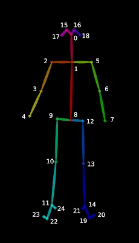
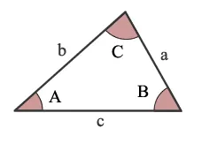
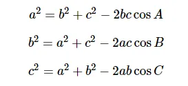

> 本文介绍了如何使用 openpose 计算人体骨骼角度，基于 python 编程语言实现，并给出了完整的示例代码。 使用 openpose 计算人体骨骼角度

环境
--

*   windows 10 64bit
*   openpose 1.7.0
*   python 3.8

前言
--

在前文 [windows 编译 openpose 及在 python 中调用](https://xugaoxiang.com/2021/05/29/build-openpose-for-windows-python-api/) 的基础上，本篇在 `openpose` 输出的骨骼关节点信息基础上，计算出相关部位的角度。

基本原理与实例代码
---------

`openpose` 输出的关键点信息如下图，总共有 25 个关节点



序列对应的关节名称如下

```
{0,  "Nose"},
{1,  "Neck"},
{2,  "RShoulder"},
{3,  "RElbow"},
{4,  "RWrist"},
{5,  "LShoulder"},
{6,  "LElbow"},
{7,  "LWrist"},
{8,  "MidHip"},
{9,  "RHip"},
{10, "RKnee"},
{11, "RAnkle"},
{12, "LHip"},
{13, "LKnee"},
{14, "LAnkle"},
{15, "REye"},
{16, "LEye"},
{17, "REar"},
{18, "LEar"},
{19, "LBigToe"},
{20, "LSmallToe"},
{21, "LHeel"},
{22, "RBigToe"},
{23, "RSmallToe"},
{24, "RHeel"},
{25, "Background"}
```

要计算这个角度，使用的是余弦定理。先来回顾一下，看下面这张图



夹角用大写 `A`、`B`、`C` 表示，边长用小写 `a`、`b`、`c` 来表示，余弦定理的数学公式如下



因此，可得出，各角度的计算公式


最后，来看看 `python` 代码实例

```python
# keypoints_from_images.py
import sys
import cv2
import os
from sys import platform
import argparse
import time
import math
def angle_between_points( p0, p1, p2 ):
    # 计算角度
    a = (p1[0]-p0[0])**2 + (p1[1]-p0[1])**2
    b = (p1[0]-p2[0])**2 + (p1[1]-p2[1])**2
    c = (p2[0]-p0[0])**2 + (p2[1]-p0[1])**2
    if a * b == 0:
        return -1.0 
    return  math.acos( (a+b-c) / math.sqrt(4*a*b) ) * 180 /math.pi
def get_angle_point(human, pos):
    # 返回各个部位的关键点
    pnts = []
    if pos == 'left_elbow':
        pos_list = (5,6,7)
    elif pos == 'left_hand':
        pos_list = (1,5,7)
    elif pos == 'left_knee':
        pos_list = (12,13,14)
    elif pos == 'left_ankle':
        pos_list = (5,12,14)
    elif pos == 'right_elbow':
        pos_list = (2,3,4)
    elif pos == 'right_hand':
        pos_list = (1,2,4)
    elif pos == 'right_knee':
        pos_list = (9,10,11)
    elif pos == 'right_ankle':
        pos_list = (2,9,11)
    else:
        print('Unknown  [%s]', pos)
        return pnts
    for i in range(3):
        if human[pos_list[i]][2] <= 0.1:
            print('component [%d] incomplete'%(pos_list[i]))
            return pnts
        pnts.append((int( human[pos_list[i]][0]), int( human[pos_list[i]][1])))
    return pnts
def angle_left_hand(human):
    pnts = get_angle_point(human, 'left_hand')
    if len(pnts) != 3:
        print('component incomplete')
        return -1
    angle = 0
    if pnts is not None:
        angle = angle_between_points(pnts[0], pnts[1], pnts[2])
        print('left hand angle:%f'%(angle))
    return angle
def angle_left_elbow(human):
    pnts = get_angle_point(human, 'left_elbow')
    if len(pnts) != 3:
        print('component incomplete')
        return
    angle = 0
    if pnts is not None:
        angle = angle_between_points(pnts[0], pnts[1], pnts[2])
        print('left elbow angle:%f'%(angle))
    return angle
def angle_left_knee(human):
    pnts = get_angle_point(human, 'left_knee')
    if len(pnts) != 3:
        print('component incomplete')
        return
    angle = 0
    if pnts is not None:
        angle = angle_between_points(pnts[0], pnts[1], pnts[2])
        print('left knee angle:%f'%(angle))
    return angle
def angle_left_ankle(human):
    pnts = get_angle_point(human, 'left_ankle')
    if len(pnts) != 3:
        print('component incomplete')
        return
    angle = 0
    if pnts is not None:
        angle = angle_between_points(pnts[0], pnts[1], pnts[2])
        print('left ankle angle:%f'%(angle))
    return angle
def angle_right_hand(human):
    pnts = get_angle_point(human, 'right_hand')
    if len(pnts) != 3:
        print('component incomplete')
        return
    angle = 0
    if pnts is not None:
        angle = angle_between_points(pnts[0], pnts[1], pnts[2])
        print('right hand angle:%f'%(angle))
    return angle
def angle_right_elbow(human):
    pnts = get_angle_point(human, 'right_elbow')
    if len(pnts) != 3:
        print('component incomplete')
        return
    angle = 0
    if pnts is not None:
        angle = angle_between_points(pnts[0], pnts[1], pnts[2])
        print('right elbow angle:%f'%(angle))
    return angle
def angle_right_knee(human):
    pnts = get_angle_point(human, 'right_knee')
    if len(pnts) != 3:
        print('component incomplete')
        return
    angle = 0
    if pnts is not None:
        angle = angle_between_points(pnts[0], pnts[1], pnts[2])
        print('right knee angle:%f'%(angle))
    return angle
def angle_right_ankle(human):
    pnts = get_angle_point(human, 'right_ankle')
    if len(pnts) != 3:
        print('component incomplete')
        return
    angle = 0
    if pnts is not None:
        angle = angle_between_points(pnts[0], pnts[1], pnts[2])
        print('right ankle angle:%f'%(angle))
    return angle
try:
    # Import Openpose (Windows/Ubuntu/OSX)
    dir_path = os.path.dirname(os.path.realpath(__file__))
    try:
        # Windows Import
        if platform == "win32":
            # Change these variables to point to the correct folder (Release/x64 etc.)
            sys.path.append(dir_path + '/../../build/python/openpose/Debug');
            # sys.path.append(dir_path + '/../../build/python/openpose/Debug')
            # os.environ['PATH']  = os.environ['PATH'] + ';' + dir_path + '/../../build/x64/Debug;' +  dir_path + '/../../bin;'
            os.environ['PATH']  = os.environ['PATH'] + ';' + dir_path + '/../../build/x64/Debug;' +  dir_path + '/../../build/bin;'
            import pyopenpose as op
        else:
            # Change these variables to point to the correct folder (Release/x64 etc.)
            sys.path.append('../../python')
            # If you run `make install` (default path is `/usr/local/python` for Ubuntu), you can also access the OpenPose/python module from there. This will install OpenPose and the python library at your desired installation path. Ensure that this is in your python path in order to use it.
            # sys.path.append('/usr/local/python')
            from openpose import pyopenpose as op
    except ImportError as e:
        print('Error: OpenPose library could not be found. Did you enable `BUILD_PYTHON` in CMake and have this Python script in the right folder?')
        raise e
    # Flags
    parser = argparse.ArgumentParser()
    parser.add_argument("--image_dir", default="images", help="Process a directory of images. Read all standard formats (jpg, png, bmp, etc.).")
    parser.add_argument("--no_display", default=False, help="Enable to disable the visual display.")
    args = parser.parse_known_args()
    # Custom Params (refer to include/openpose/flags.hpp for more parameters)
    params = dict()
    params["model_folder"] = "../../models/"
    # Add others in path?
    for i in range(0, len(args[1])):
        curr_item = args[1][i]
        if i != len(args[1])-1: next_item = args[1][i+1]
        else: next_item = "1"
        if "--" in curr_item and "--" in next_item:
            key = curr_item.replace('-','')
            if key not in params:  params[key] = "1"
        elif "--" in curr_item and "--" not in next_item:
            key = curr_item.replace('-','')
            if key not in params: params[key] = next_item
    # Starting OpenPose
    opWrapper = op.WrapperPython()
    opWrapper.configure(params)
    opWrapper.start()
    # Read frames on directory
    imagePaths = op.get_images_on_directory(args[0].image_dir);
    # Process and display images
    for imagePath in imagePaths:
        datum = op.Datum()
        imageToProcess = cv2.imread(imagePath)
        datum.cvInputData = imageToProcess
        opWrapper.emplaceAndPop(op.VectorDatum([datum]))
        # print("Body keypoints: \n" + str(datum.poseKeypoints))
        human_count = len(datum.poseKeypoints)
        # for i in range(human_count):
        #   for j in range(25):
        #        print(datum.poseKeypoints[i][j][0])
        for i in range(human_count):
            angle_left_hand(datum.poseKeypoints[i] )
            angle_left_elbow(datum.poseKeypoints[i] )
            angle_left_knee(datum.poseKeypoints[i] )
            angle_left_ankle(datum.poseKeypoints[i] )
            angle_right_hand(datum.poseKeypoints[i] )
            angle_right_elbow(datum.poseKeypoints[i] )
            angle_right_knee(datum.poseKeypoints[i] )
            angle_right_ankle(datum.poseKeypoints[i] )
        if not args[0].no_display:
            cv2.imshow("OpenPose 1.7.0 - Tutorial Python API", datum.cvOutputData)
            cv2.imwrite("{}.jpg".format(time.time()), datum.cvOutputData)
            key = cv2.waitKey(15)
            if key == 27: break
except Exception as e:
    print(e)
    sys.exit(-1)
```

最后准备张测试图片，执行代码

```shell
python keypoints_from_images.py --image_dir ..\media
```

可以得到

```
Starting OpenPose Python Wrapper...
Auto-detecting all available GPUs... Detected 1 GPU(s), using 1 of them starting at GPU 0.
left hand angle:72.597296
left elbow angle:105.013366
left knee angle:150.508638
left ankle angle:157.977345
right hand angle:91.741660
right elbow angle:111.680674
right knee angle:154.645155
right ankle angle:174.466738
component [7] incomplete
component incomplete
component [6] incomplete
component incomplete
left knee angle:99.754916
left ankle angle:149.442500
right hand angle:135.324925
right elbow angle:169.808498
component [10] incomplete
component incomplete
component [11] incomplete
component incomplete
```

这里解释一下，以左手为例，它对应的三个关键点是 (1, 2, 4)，也就是下图中的三根黑线的交点，计算出来的角度如图所示，为 72.597296 度


参考资料
----

*   [https://github.com/CMU-Perceptual-Computing-Lab/openpose](https://github.com/CMU-Perceptual-Computing-Lab/openpose)
*   [https://xugaoxiang.com/2021/05/29/build-openpose-for-windows-python-api/](https://xugaoxiang.com/2021/05/29/build-openpose-for-windows-python-api/)
*   [https://xugaoxiang.com/2020/10/26/openpose-build/](https://xugaoxiang.com/2020/10/26/openpose-build/)